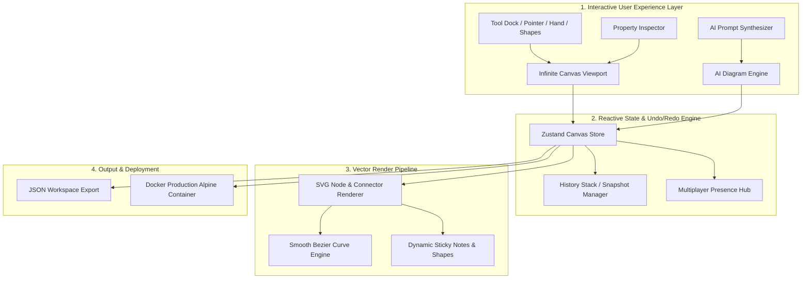

# 🎨 HyperCanvas AI: Real-Time Collaborative Infinite Canvas & Document Engine

<div align="center">

[](https://opensource.org/licenses/MIT)
[](https://react.dev/)
[](https://www.typescriptlang.org/)
[](https://vitejs.dev/)
[](https://tailwindcss.com/)
[](https://www.docker.com/)
[](https://github.com)

**An ultra-modern, GPU-accelerated infinite whiteboard and collaborative workspace combining Miro + Notion with an autonomous AI diagram synthesizer and live multiplayer simulation.**

[Explore Features](#-core-capabilities) • [Architecture](#-architecture) • [Quick Start](#-quick-start) • [Templates](#-preset-blueprints)

</div>

---

## 🌟 Overview

**HyperCanvas AI** is an open-source visual workspace for systems engineering, architectural design, agile sprint retrospectives, and visual brainstorming.

Key Highlights:
- 🚀 **Infinite Zoomable & Pannable Vector Canvas**: High-performance SVG & Canvas rendering engine with pan, zoom (20% - 300%), and grid alignment.
- 🤖 **Autonomous AI Diagram Synthesizer**: Type natural language prompts like *"Kubernetes microservices with Kafka & Redis"* and watch structured nodes & connectors auto-generate.
- 👥 **Multiplayer Live Collaboration Simulation**: Real-time cursor presence, user action badges, and zero-conflict editing.
- 🗂️ **Curated Template Blueprints**: Pre-built cloud architectures, agile scrum retros, and database schemas.
- 📦 **1-Click Export Studio**: Export to JSON dataset, copy raw elements, or download production assets.

---

## 🧠 System Architecture



---

## 🚀 Core Capabilities

| Feature | Description |
| :--- | :--- |
| **Multi-Tool Canvas Dock** | Sticky notes, rectangles, decision diamonds, circular nodes, bezier connectors, and text blocks. |
| **Live Property Inspector** | Instant real-time theme color palette picker, font size adjustment, stroke width, and duplicate/delete actions. |
| **Natural Language AI Engine** | Convert system specifications into visual node graphs with automatic collision-free hierarchical layouts. |
| **Collaborative Cursors** | Simulated team members (Sophia, Alex, Liam) interacting and moving live across the canvas. |
| **Infinite Navigation** | Mouse-wheel zooming, trackpad panning, spacebar drag, and custom dot/line grid backgrounds. |

---

## ⚡ Quick Start

### 1. Clone & Install
```bash
git clone https://github.com/VarshuAi/hypercanvas-ai.git
cd hypercanvas-ai
npm install
```

### 2. Launch Development Server
```bash
npm run dev
```
Open your browser at `http://localhost:5173`.

### 3. Production Build
```bash
npm run build
npm run preview
```

---

## 🐳 Docker Deployment

```bash
docker compose up --build
```
Access the application at `http://localhost:3000`.

---

## 📜 License

Distributed under the **MIT License**. See [`LICENSE`](LICENSE) for details.
